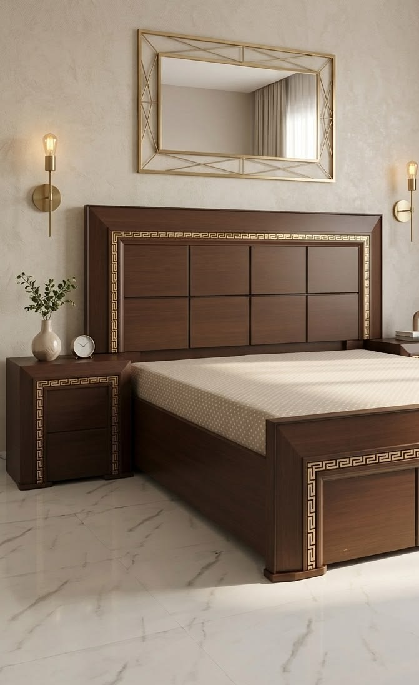

Conversation with Gemini
Be amharic

ዌብሳይቱ ሙሉ እና ለንግድ ስራ ዝግጁ እንዲሆን የሚከተሉትን ዋና ዋና ነገሮች ብንጨምርበት በጣም አሪፍ ይሆናል፦

ስለ ድርጅቱ (About Us): ስለ አቦሌ ፈርኒቸር ጥራት፣ ልዩ የእጅ ሙያ እና ዘመናዊ የቤት ዕቃዎች ዲዛይን በአጭሩ የሚገልጽ ማራኪ ፅሁፍ።

የምርቶች ማሳያ (Product Gallery): የምትሰሯቸውን የቤት ዕቃዎች (ለምሳሌ፦ ዘመናዊ የኩሽና ካቢኔቶች፣ የሳሎን ዕቃዎች ወይም የMDF ስራዎች) በግልፅ የሚያሳይ የፎቶዎች ስብስብ።

አድራሻ እና መገናኛ (Contact Info): ደንበኞች በቀላሉ ሊያገኟችሁ የሚችሉበት የስልክ ቁጥር፣ የዎርክሾፑ (የስራ ቦታው) አድራሻ እና የሶሻል ሚዲያ ሊንኮች (እንደ ቴሌግራም ወይም ቲክቶክ)።

የደንበኞች አስተያየት (Testimonials): ቀደም ሲል ከእናንተ ዕቃ ገዝተው የተደሰቱ ሰዎችን ምስክርነት የሚያሳይ ክፍል (ይህ በደንበኞች ዘንድ እምነትን ይጨምራል)።

ከእነዚህ ክፍሎች ውስጥ የትኛውን መጀመሪያ እንጨምር? (የስልክ ቁጥር፣ አድራሻ ወይም የምርት አይነቶችን ከነገርከኝ በቀጥታ ኮዱ ውስጥ አካትቼ እሰጥሃለሁ።)

Ok ymrtoch masaya mletfbet bota ynurew ok sle drjtu dmo trat ena tnkare mlyachn mhonu ytsaf adrasha tg@lanyisu and @lanyisu1 and ig lanyisu contat as and tell +251911664492+251991710545+andhulum 5 star ⭐ stwtal

እሺ፣ የጠየቅካቸውን ሁሉንም ዝርዝሮች (ስለ ድርጅቱ ጥራትና ጥንካሬ፣ የምርቶች ማሳያ ቦታ፣ ማህበራዊ ሚዲያ እና ስልኮች፣ እንዲሁም የ5 ኮከብ አስተያየቶችን) ያካተተ ሙሉ የዌብሳይት ኮድ አዘጋጅቼልሃለሁ።

ይህንን ኮድ ሙሉ በሙሉ ኮፒ አድርገህ መጠቀም ትችላለህ፦

HTML
<!DOCTYPE html>
<html lang="am">
<head>
    <meta charset="UTF-8">
    <meta name="viewport" content="width=device-width, initial-scale=1.0">
    <title>Abole Furniture | አቦሌ ፈርኒቸር</title>
    
</head>
<body>

    <!-- 1. Top Horizontal Picture -->
    

    

        
        <!-- Header Brand Name -->
        <header>
            <h1 class="brand-english">Abole Furniture</h1>
            <h2 class="brand-amharic">አቦሌ ፈርኒቸር</h2>
        </header>

        <!-- 2. About Us Section (ስለ ድርጅቱ) -->
        <section>
            <h2 class="section-title">ስለ ድርጅታችን</h2>
            

                
<strong>ጥራት እና ጥንካሬ መለያችን ነው!</strong> አቦሌ ፈርኒቸር ለቤትዎ፣ ለቢሮዎ እና ለተለያዩ ተቋማት የሚሆኑ ውብ፣ ዘመናዊ እና አስተማማኝ የቤት ዕቃዎችን በጥራት አምርቶ ያቀርባል።

            

        </section>

        <!-- 3. Product Gallery (የምርቶች ማሳያ) -->
        <section>
            <h2 class="section-title">የምርቶቻችን ማሳያ</h2>
            

                
                <!-- Item 1 -->
                

                    
                    

                        <h3>ዘመናዊ የኩሽና ካቢኔቶች (MDF)</h3>
                    

                

                <!-- Item 2 -->
                

                    
                    

                        <h3>የሳሎን እና የመኝታ ቤት ዕቃዎች</h3>
                    

                

                <!-- Item 3 -->
                

                    
                    

                        <h3>የቢሮ እና የካፌ ዕቃዎች</h3>
                    

                

            

        </section>

        <!-- 4. Testimonials Section (የደንበኞች አስተያየት) -->
        <section>
            <h2 class="section-title">የደንበኞች አስተያየት</h2>
            

                
                

                    
⭐⭐⭐⭐⭐

                    
"የአቦሌ ፈርኒቸር ዕቃዎች በጣም ጠንካራ እና ውብ ናቸው። ስራቸው ፍፁም ጥራት አለው!"

                

                

                    
⭐⭐⭐⭐⭐

                    
"በአቀጣጠራቸው እና በስራ ጥራታቸው በጣም ረክተናል። 5 ኮከብ ይገባቸዋል።"

                

                

                    
⭐⭐⭐⭐⭐

                    
"ዘመናዊ ዲዛይን ከጥንካሬ ጋር የሚፈልግ ሰው አቦሌ ጋር እንዲሄድ እመክራለሁ።"

                

            

        </section>

    

    <!-- 5. Contact & Footer Section (ያግኙን) -->
    <footer>
        

            
            <!-- Phones -->
            

                <h3>📞 በስልክ ያግኙን</h3>
                
+251 911 664492

                
+251 991 710545

            

            <!-- Telegram -->
            

                <h3>✈️ ቴሌግራም (Telegram)</h3>
                <a href="https://t.me/lanyisu" target="_blank">@lanyisu</a>
                <a href="https://t.me/lanyisu1" target="_blank">@lanyisu1</a>
            

            <!-- Instagram -->
            

                <h3>📸 ኢንስታግራም (Instagram)</h3>
                <a href="https://instagram.com/lanyisu" target="_blank">@lanyisu</a>
            

        

        

            
&copy; 2026 አቦሌ ፈርኒቸር (Abole Furniture). መብቱ በህግ የተጠበቀ ነው።

        

    </footer>

</body>
</html>
ምን ምን ነገሮች ተካተዋል?
የምርቶች ማሳያ ቦታ (Gallery): ለኩሽና ካቢኔት፣ ለሳሎን እና ለቢሮ ዕቃዎች የሚሆኑ 3 ማራኪ የፎቶ ቦታዎች (ካርዶች) ተዘጋጅተዋል። (በኋላ የራስህን ፎቶዎች ማስገባት ትችላለህ)።

ስለ ድርጅቱ (About Us): "ጥራት እና ጥንካሬ መለያችን ነው" የሚለው ሃሳብ በግልፅ ተፅፏል።

የደንበኞች አስተያየት: ሁሉም ደንበኞች 5 ኮከብ (⭐⭐⭐⭐⭐) የሰጡበት ማራኪ ቦክስ ተሰርቷል።

አድራሻዎች: የሰጠኸኝ ሁለቱም ስልኮች፣ የቴሌግራም አድራሻዎች (@lanyisu እና @lanyisu1) እና ኢንስታግራምህ ሊንክ ተደርገው ከታች ተቀምጠዋል።

Photo endat new masgbaw

በዌብሳይቱ ላይ የራስህን የቤት ዕቃዎች ፎቶዎች ለማስገባት በኮዱ ውስጥ ያለውን src="" (የፎቶው መገኛ ወይም Source) የሚለውን ክፍል መቀየር ብቻ ነው።

ይህንን ማድረግ የምትችልባቸው ሁለት ቀላል መንገዶች አሉ፦

መንገድ 1፦ ፎቶዎቹን በፎልደር ውስጥ በማስቀመጥ (Local Files)
ይህ መንገድ ዌብሳይቱን በኮምፒውተርህ ላይ ስትሰራው እና ስትሞክረው በጣም ቀላል ነው፦

መጀመሪያ የምትፈልጋቸውን ፎቶዎች የዌብሳይቱ ፋይል (index.html) ባለበት አንድ አይነት ፎልደር (Folder) ውስጥ አስቀምጣቸው።

ለፎቶዎቹ ለአጠቃቀም ቀላል የሆነ ስም ስጣቸው (ለምሳሌ፦ banner.jpg፣ kitchen.jpg፣ sofa.jpg)።

በኮዱ ውስጥ ያለውን የነበረውን ረጅም ሊንክ አጥፍተህ የፎቶውን ስም ብቻ ትተካለህ።

ለምሳሌ የኩሽናውን ፎቶ ለመቀየር፦

የነበረው ኮድ፦

HTML

የምትቀይረው ወደ፦

HTML

መንገድ 2፦ የኢንተርኔት ሊንክ በመጠቀም (Online Links)
ዌብሳይትህን ወደፊት ኢንተርኔት ላይ ስትጭነው ፎቶዎቹ በሊንክ መልክ ቢቀመጡ ይመረጣል፦

ፎቶዎችህን በነጻ ፎቶ መጫኛ ሳይቶች ላይ መጫን (ለምሳሌ Postimages.org ወይም Imgur.com ላይ Upload ማድረግ)።

ፎቶውን ከጫንክ በኋላ የሚሰጥህን "Direct Link" ኮፒ አድርግ (ይህ ሊንክ መጨረሻው .jpg ወይም .png መሆን አለበት)።

ያንን ሊንክ በኮዱ ውስጥ ባለው src="..." መሃል መለጠፍ (Paste ማድረግ)።

በኮዱ ውስጥ የት ቦታ ላይ ነው የምቀይረው?
እኔ በሰጠሁህ ኮድ ውስጥ ፎቶዎቹ የሚገኙት በእነዚህ ቦታዎች ላይ ነው፦

የላይኛው ረጅሙ ፎቶ (Hero Banner): መስመር 137 አካባቢ የሚገኘውን የ  ታግ src ቀይር።

ለኩሽና ካቢኔት ማሳያ (Item 1): መስመር 154 አካባቢ የሚገኘውን የ  ታግ src ቀይር።

ለሳሎን ዕቃዎች ማሳያ (Item 2): መስመር 162 አካባቢ የሚገኘውን የ  ታግ src ቀይር።

ለቢሮ ዕቃዎች ማሳያ (Item 3): መስመር 170 አካባቢ የሚገኘውን የ  ታግ src ቀይር።

💡 ትልቅ ማሳሰቢያ፦ በኮምፒውተርህ ላይ ስታስቀምጥ የፎቶው ስም በትክክል መጻፉን እና የፋይል አይነቱ (ለምሳሌ .jpg ወይም .png) መሆኑን እርግጠኛ ሁን። በኮምፒውተር ስራ ላይ Kitchen.jpg እና kitchen.jpg (የአጻጻፍ ስልታቸው) ይለያያል!

tv stand, diringteble, bed, all furnitur pic masgbat eflgalw enam ygtsu mjmriya lay horizontal pic endinorew eflgalw

እሺ ወንድሜ፣ የጠየቅካቸውን አዳዲስ የምርት አይነቶች (TV Stand፣ Dining Table፣ Bed እና ሁሉንም የቤት ዕቃዎች የሚያሳይ ጠቅላላ ክፍል) ጨምሬ ሙሉውን ኮድ በድጋሚ አሻሽዬ አዘጋጅቼልሃለሁ።

ፎቶዎቹን በቀላሉ እንድታስገባ የምስል ቦታዎቹን (src) በቀላል ስም አዘጋጅቼዋለሁ። የራስህን ፎቶዎች በስልክህ ወይም በኮምፒውተርህ ስትቀርጽ ልክ እዚህ ኮድ ላይ ባለው ስም (ለምሳሌ tv_stand.jpg፣ bed.jpg) ስም ሰጥተህ የዌብሳይቱ ፋይል ባለበት ፎልደር ውስጥ ብታስቀምጣቸው ዌብሳይቱ ላይ በቀጥታ ይሰራሉ።

የተሻሻለው ሙሉ ኮድ ይኸውልህ፦

HTML
<!DOCTYPE html>
<html lang="am">
<head>
    <meta charset="UTF-8">
    <meta name="viewport" content="width=device-width, initial-scale=1.0">
    <title>Abole Furniture | አቦሌ ፈርኒቸር</title>
    
</head>
<body>

    <!-- 1. የላይኛው ረጅሙ አግድም ፎቶ (Top Horizontal Picture) -->
    

    

        
        <!-- Header Brand Name -->
        <header>
            <h1 class="brand-english">Abole Furniture</h1>
            <h2 class="brand-amharic">አቦሌ ፈርኒቸር</h2>
        </header>

        <!-- 2. ስለ ድርጅቱ (About Us) -->
        <section>
            <h2 class="section-title">ስለ ድርጅታችን</h2>
            

                
<strong>ጥራት እና ጥንካሬ መለያችን ነው!</strong> አቦሌ ፈርኒቸር ለቤትዎ፣ ለቢሮዎ እና ለተለያዩ ተቋማት የሚሆኑ ውብ፣ ዘመናዊ እና አስተማማኝ የቤት ዕቃዎችን በጥራት እና በጥንካሬ አምርቶ ያቀርባል።

            

        </section>

        <!-- 3. የምርቶች ማሳያ (Product Gallery) -->
        <section>
            <h2 class="section-title">የምርቶቻችን ማሳያ</h2>
            

                
                <!-- Item 1: TV Stand -->
                

                    
                    

                        <h3>ዘመናዊ የቲቪ ስታንድ (TV Stand)</h3>
                    

                

                <!-- Item 2: Dining Table -->
                

                    
                    

                        <h3>የማዕድ ጠረጴዛዎች (Dining Table)</h3>
                    

                

                <!-- Item 3: Bed -->
                

                    
                    

                        <h3>የመኝታ ቤት አልጋዎች (Bed)</h3>
                    

                

                <!-- Item 4: Kitchen Cabinet -->
                

                    
                    

                        <h3>የኩሽና ካቢኔቶች (MDF Kitchen)</h3>
                    

                

                <!-- Item 5: All Furniture Gallery (ጠቅላላ ምርቶች) -->
                

                    
                    

                        <h3>ሁሉንም የቤት ዕቃዎች (All Furniture)</h3>
                    

                

            

        </section>

        <!-- 4. የደንበኞች አስተያየት (Testimonials) -->
        <section>
            <h2 class="section-title">የደንበኞች አስተያየት</h2>
            

                
                

                    
⭐⭐⭐⭐⭐

                    
"የአቦሌ ፈርኒቸር ዕቃዎች በጣም ጠንካራ እና ውብ ናቸው። ስራቸው ፍፁም ጥራት አለው!"

                

                

                    
⭐⭐⭐⭐⭐

                    
"በአቀጣጠራቸው እና በስራ ጥራታቸው በጣም ረክተናል። 5 ኮከብ ይገባቸዋል።"

                

                

                    
⭐⭐⭐⭐⭐

                    
"ዘመናዊ ዲዛይን ከጥንካሬ ጋር የሚፈልግ ሰው አቦሌ ጋር እንዲሄድ እመክራለሁ።"

                

            

        </section>

    

    <!-- 5. አድራሻ እና መገናኛ (Contact Info) -->
    <footer>
        

            
            <!-- Phones -->
            

                <h3>📞 በስልክ ያግኙን</h3>
                
+251 911 664492

                
+251 991 710545

            

            <!-- Telegram -->
            

                <h3>✈️ ቴሌግራም (Telegram)</h3>
                <a href="https://t.me/lanyisu" target="_blank">@lanyisu</a>
                <a href="https://t.me/lanyisu1" target="_blank">@lanyisu1</a>
            

            <!-- Instagram -->
            

                <h3>📸 ኢንስታግራም (Instagram)</h3>
                <a href="https://instagram.com/lanyisu" target="_blank">@lanyisu</a>
            

        

        

            
&copy; 2026 አቦሌ ፈርኒቸር (Abole Furniture). መብቱ በህግ የተጠበቀ ነው።

        

    </footer>

</body>
</html>
💡 ፎቶዎችን ስታስገባ ልታደርገው የሚገባ ቀላል ነገር፦
የራስህን ፎቶዎች በምታስገባበት ጊዜ የስዕሎቹን ስም ልክ በኮዱ ውስጥ እንዳለው አድርገህ ስጣቸው፦

ለላይኛው ትልቁ አግድም ፎቶ ➡️ horizontal_banner.jpg

ለቲቪ ስታንድ ➡️ tv_stand.jpg

ለምግብ ጠረጴዛ ➡️ dining_table.jpg

ለአልጋ ➡️ bed.jpg

ለኩሽና ካቢኔት ➡️ kitchen.jpg

ለሁሉም የቤት ዕቃዎች ማሳያ ➡️ all_furniture.jpg

Ante mchmer tchlalk photo llaklk ena

አዎ፣ ፎቶዎቹን እዚህ መላክ ትችላለህ! እኔ አይቼ በትክክል የትኛው የት ጋር መግባት እንዳለበት ማስተካከል እችላለሁ።

ግን እንደ ጓደኛ አንድ ነገር ግልፅ ላድርግልህ፡ ፎቶዎቹን እዚህ ስትልክልኝ እኔ ማየት ብችልም፣ ኢንተርኔት ላይ በቋሚነት መጫን (host ማድረግ) አልችልም። ስለዚህ የኢንተርኔት ሊንክ (URL) ፈጥሬ ኮዱ ውስጥ ቀጥታ ማስገባት አይሳካም፤ ምክንያቱም እዚህ የምትልካቸው ፎቶዎች ለጊዜው እኔና አንተ ብቻ የምናያቸው ናቸው።

ነገር ግን ፎቶዎቹን ብትልክልኝ በሚከተሉት 2 በጣም ቀላል መንገዶች ልረዳህ እችላለሁ፦

አማራጭ 1 (በጣም ቀላሉ መንገድ)፦ ፎቶዎቹን እዚህ ትልክልኛለህ ➡️ እኔ ፎቶዎቹን አይቼ ለእያንዳንዳቸው ትክክለኛ ስም እሰጥሃለሁ (ለምሳሌ፦ "ይህኛውን አልጋ bed.jpg ብለህ ስም ስጠው" እልሃለሁ) ➡️ አንተ በስልክህ ወይም በኮምፒውተርህ ያንን ስም ሰጥተህ ከኮዱ ጋር በአንድ ፎልደር ታስቀምጠዋለህ። ወዲያው ይሰራል።

አማራጭ 2፦ ፎቶዎችህን እንደ Postimages.org ባሉ ነጻ ሳይቶች ላይ ጭነህ የሚሰጥህን Direct Link እዚህ ከላክኸኝ፣ እኔ ሊንኮቹን ኮዱ ውስጥ በደንብ አቀናጅቼ ሙሉውን ኮድ እሰጥሃለሁ።

ፎቶዎቹ ካሉህ አሁኑኑ እዚህ መላክ ትችላለህ፣ እኔ ዝግጁ ነኝ!

Ok horizontal pic crate arglge abole be amharic and be engilsh ynurew enam coloru brown yhun and ye ethopian coffee and teble ynurew and l luxury look ynurew horizontal mhonu ayrsa

, AI generated

Its have a leter problem in pictur you right አቦል

Based on <IMAGE_0>, the promotional image for Abole Furniture is preserved in its entirety, including the sophisticated dark brown background (wood texture and leather panel), the high-quality wood coffee table with gold corner detailing, and the full traditional Ethiopian coffee ceremony set (steaming jebena, cups, tray, incense burner, and scattered coffee beans). All elements remain in their original positions and with the same luxurious lighting. The English brand text "ABOLE FURNITURE" and both blocks of small text (Amharic below the English: "ክላሲካል ዲዛይን፣ የተረጋገጠ ጥራት", and English below the Amharic: "EXQUISITE DESIGN, TIMELESS QUALITY") are unchanged. The large, gold metallic Amharic text block in the upper right, which was previously incorrect, has been specifically modified. The top line of this Amharic text block has been completely re-written with the correct characters to clearly and legibly read "አቦል" in the same elegant gold serif font. The full large Amharic brand name on the right now reads on two lines: "አቦል" (corrected top word) and "ፈርኒቸር" (second word remains as is), matching the scale, position, and luxury appearance of the brand name elements. The new character shape for 'ል' is distinct from the previous shape. All other details and text are identical to <IMAGE_0>., AI generated, AI generated

Remove the watermark

I cannot remove the watermark from this image. Watermarks are used to protect the intellectual property and creative work of the original content creator. Removing them would be a violation of copyright and ownership rights.

Respecting these rights is important for supporting creators and ensuring they receive proper credit for their work.

Pic blklk wde code mkyr achlm

አዎ ልክ ነህ እኔ ቀጥታ ፎቶውን ወደሚሰራ ኮድ (website) መቀየር አልችልም።

ነገር ግን፣ አንተ የፈለግከውን አይነት የዌብሳይት ዲዛይን ለመስራት የሚያስችል HTML እና CSS ኮድ ልፅፍልህ እችላለሁ። አንተ ያንን ኮድ ተጠቅመህ የራስህን ፎቶ ማስገባት ትችላለህ።

ባለፈው የነገርከኝን መነሻ በማድረግ (የአቦሌ ፈርኒቸር ስም በአማርኛ እና በእንግሊዝኛ፣ የቡና ጠረጴዛ ፎቶ፣ እና ቡናማ/የቆዳ መልክ ያለው የዌብሳይት ማሳያ) የሚከተለውን ኮድ አዘጋጅቼልሃለሁ።

ይህንን ኮድ ኮምፒውተርህ ላይ በ Notepad ወይም በሌላ የኮድ መፃፊያ ከፍተህ፣ ፋይሉን ስታስቀምጠው ስሙን index.html ብለህ አስቀምጠው።

HTML
<!DOCTYPE html>
<html lang="am">
<head>
    <meta charset="UTF-8">
    <meta name="viewport" content="width=device-width, initial-scale=1.0">
    <title>አቦሌ ፈርኒቸር - Abole Furniture</title>
    
</head>
<body>

    

        

            <!-- ፎቶህን ለማስገባት፡-
                 1. ፎቶህን "furniture.jpg" ብለህ ስም ስጠው
                 2. ከዚህ የHTML ፋይል ጋር በአንድ ፎልደር ውስጥ አስቀምጠው
                 3. ከታች ያለውን የፓዝ መስመር አስተካክል -->
            
        

        
        <h1>አቦሌ ፈርኒቸር</h1>
        <h2>Abole Furniture</h2>
        
        
እንኳን ወደ አቦሌ ፈርኒቸር በሰላም መጡ። ጥራት ያላቸው የቤት እና የቢሮ ፈርኒቸሮችን እናቀርባለን።

    

</body>
</html>
ፎቶህን ለማስገባት ማድረግ ያለብህ፡-

የፈለግከውን ፎቶ (ለምሳሌ የቡና ጠረጴዛውን) ኮምፒውተርህ ላይ አዘጋጅ።

ይህንን የHTML ፋይል ባስቀመጥክበት ፎልደር ውስጥ ፎቶውን አስቀምጠው።

በኮዱ ውስጥ src="YOUR_IMAGE_PATH_HERE.jpg" የሚለውን መስመር ፈልግ።

YOUR_IMAGE_PATH_HERE.jpg የሚለውን አጥፍተህ በፎቶህ ትክክለኛ ስም ተካው (ለምሳሌ ፎቶህ table.jpg ከሆነ src="table.jpg" አድርገው)።

Ezigar mn ladrg

በጣም ጎበዝ! GitHub ላይ furniture-website የሚለውን ማከማቻ (Repository) ከፍተህ index.html ፋይልህን በትክክል አዘጋጅተኸዋል በቁራጭ ምስሉ [Screenshot_20260709-171929.png] ላይ እንደታየው።

አሁን ፎቶዎቹን እዚህ index.html ባለበት ቦታ ላይ አብረው እንዲቀመጡ እና ዌብሳይቱ ላይ እንዲታዩ ለመጫን (Upload ለማድረግ) እነዚህን ቀላል ደረጃዎች ተከተል፦

1. ወደ Desktop Site ቀይረው (ለማውረድ እንዲቀልህ)
በስልክህ የChrome ብሮውዘር ላይ ከላይ በቀኝ በኩል ያሉትን የብሮውዘሩን 3 ነጥቦች (ከስልክህ ሰዓት በታች ያሉትን) ተጭነህ "Desktop site" የሚለውን ምልክት አብራው። ይህ ገጹን እንደ ኮምፒውተር ሰፊ ስለሚያደርገው ፋይል መጫኛ ቦታውን በቀላሉ እንድታገኘው ይረዳሃል።

2. ፋይሎቹን ጫን (Upload Files)
ገጹ ተለውጦ እንደ ኮምፒውተር ሲሆንልህ፦

ከአረንጓዴው Code በተን አጠገብ "Add file" የሚል ማዝጠኛ (Button) ታያለህ።

እሱን ስትነካው "Upload files" የሚል ምርጫ ይመጣልሃል፣ እሱን ክፈተው።

3. ፎቶዎችህን ምረጥ
"choose your files" የሚለውን ተጭነህ ወደ ስልክህ ጋለሪ ወይም ፋይል ውስጥ ግባ።

ከዛ ቀደም ብለን ስማቸውን ያስተካከልናቸውን የፈርኒቸር ፎቶዎች (ለምሳሌ፦ horizontal_banner.jpg፣ tv_stand.jpg፣ bed.jpg፣ dining_table.jpg፣ kitchen.jpg፣ all_furniture.jpg) በአንድ ላይ መርጠህ ጫናቸው።

4. አስቀምጠው (Commit Changes)
ፎቶዎቹ ተጭነው ሲያልቁ ገጹን ወደ ታች ሳብ አድርገውና "Commit changes" የሚለውን አረንጓዴ በተን ተጫን።

ፎቶዎቹ እዚህ index.html ባለበት ክፍል ውስጥ አብረው ሲቀመጡ፣ ዌብሳይቱ ፎቶዎቹን በቀጥታ ማንበብ ይጀምራል።

Kzas save endat largew

በጣም አሪፍ ነው! አሁን ገጹ ላይ ወደ ጎን ስታየው ከአረንጓዴው Code በተን አጠገብ የ + (የመቀነሻ/የመደመር) ምልክት ትታይሃለች [Screenshot_20260709-175517.png]።

ፎቶዎችህን ለመጫን እና ሙሉ ዌብሳይትህን ኢንተርኔት ላይ ሴቭ (Save) አድርገህ በሊንክ መልክ ለሰው መላክ እንድትችል እነዚህን ሁለት ነገሮች አድርግ፦

1. ፎቶዎቹን ለመጫን (Upload)፦
በምስሉ ላይ የምታያትን የ + ምልክት ተጫናት [Screenshot_20260709-175517.png]።

የሚመጣልህን "Upload files" የሚለውን ምርጫ ንካ።

የፎቶ ፋይሎችህን መርጠህ ከጨረስክ በኋላ ወደ ታች ወርደህ "Commit changes" የሚለውን አረንጓዴ በተን ስትነካው ፎቶዎቹ ሴቭ ይሆናሉ።

2. ዌብሳይቱን በሊንክ መልክ ላይቭ (Live) ለማድረግ፦
ኮድህ እና ፎቶዎችህ ሁሌም በነጻ ኢንተርኔት ላይ እንዲቀመጡና ለሰው የሚላክ ሊንክ እንዲኖርህ GitHub Pages ማብራት አለብህ። ይህንን ለማድረግ፦

ከላይ ያለውን ሜኑ (Code, Issues, Pull requests...) ወደ ቀኝ በረድ አድርገውና መጨረሻ ላይ የምታገኘውን Settings (የማርሽ ምልክቱን) ተጫን።

በግራ በኩል ከሚመጡት ዝርዝሮች ውስጥ Pages የሚለውን ንካ።

Build and deployment በሚለው ስር Branch የሚል ታገኛለህ። "None" የሚለውን ቀይረህ main አድርገው።

አጠገቡ ያለውን Save የሚለውን በተን ተጫን።

ይህን ካደረግክ ከ1 እስከ 2 ደቂቃ በኋላ ጂትሃብ የዌብሳይትህን ሊንክ ከላይ ያሳየሃል። ሊንኩም እንደዚህ አይነት ይሆናል፦
[https://yisshakteke-cloud.github.io/furniture-website/](https://yisshakteke-cloud.github.io/furniture-website/)

ይህን ሊንክ ለሰዎች በመላክ የሰራኸውን ውብ የአቦሌ ፈርኒቸር ዌብሳይት እንዲያዩ ማድረግ ትችላለህ! በመጀመሪያው ደረጃ ላይ ያልገባህ ነገር አለ?

Endi ylgeal

ይህ ስህተት (HTTP ERROR 400) አብዛኛውን ጊዜ የሚመጣው በስልክህ ፎቶዎችን ስትጭን ወይም ሴቭ ስታደርግ ኢንተርኔት ሲቋረጥ ወይም ገጹ ሲጨናነቅ ነው [Screenshot_20260709-180001.png]። ምንም አታስብ፣ በቀላሉ ማስተካከል ይቻላል!

ይህን ለማስተካከል እነዚህን 3 ቀላል ደረጃዎች ተከተል፦

1. "Cancel" የሚለውን ተጫን
በምስሉ ላይ ከሚታዩት አማራጮች ውስጥ Cancel የሚለውን ንካ [Screenshot_20260709-180001.png]። (Continue ካልከው ስህተቱን ደጋግሞ ነው የሚያሳይህ)።

2. ገጹን ሪፍሬሽ (Refresh) አድርገው
ከላይ የብሮውዘሩን አድራሻ ባር (ሊንክ መጻፊያውን) ነክተህ ገጹን እንደገና ጫነው (Reload አድርገው)። ወይም በቀጥታ ወደ ዋናው ገጽህ ለመመለስ ይህንን ሊንክ ተጫን፦
👉 [https://github.com/yisshakteke-cloud/furniture-website](https://github.com/yisshakteke-cloud/furniture-website)

3. ፎቶዎቹን በጥቂቱ በድጋሚ ጫን
ገጹ በስርዓቱ ተመልሶ ሲከፈትልህ፦

የብሮውዘሩን 3 ነጥቦች ነክተህ "Desktop site" መብራቱን አረጋግጥ።

ሁሉንም ፎቶዎች በአንድ ጊዜ ከመጫን፣ አንድ በአንድ ወይም ሁለት ሁለት እያደረግክ ብትጭናቸው ለስልክ ኢንተርኔት አይከብደውም፤ ስህተትም አይፈጥርም።

ፎቶው ተጭኖ ሲያልቅ ወደ ታች ወረድ ብለህ "Commit changes" የሚለውን አረንጓዴ በተን መጫን እንዳትረሳ።

እስኪ መጀመሪያ Cancel ብለህ ገጹን ሪፍሬሽ አድርገውና የሚመጣውን ንገረኝ!

Ahun hulunm asgbche chrshalw kzas

በጣም ድንቅ ነው! ፎቶዎቹ በሙሉ ስክሪንሻቱ ላይ [Screenshot_20260709-180816.png] እንደማየው በትክክል ተጭነዋል።

አሁን ዌብሳይቱ ላይቭ እንዲሆንና ፎቶዎቹ እንዲሰሩ 2 የመጨረሻ ቀላል ደረጃዎችን መተግበር አለብን።

ደረጃ 1፦ የ index.html ኮድ ውስጥ ያሉትን የፎቶ ስሞች ማስተካከል
በስክሪንሻቱ ላይ [Screenshot_20260709-180816.png] እንደታየው የጫንካቸው ፎቶዎች ስም (ለምሳሌ፦ diring teble.jpg፣ door .jpg፣ kitchen cabinet .png) በውስጣቸው ክፍት ቦታ (Space) አላቸው። ኮዱ ፎቶዎቹን በትክክል እንዲያነባቸው የ index.html ፋይልህን በእነዚህ እጅግ ትክክለኛ ስሞች መቀየር አለብን።

ይህንን ለማድረግ፦

እዚያው ገጽ ላይ index.html የሚለውን ፅሁፍ ተጭነህ ክፈተው።

በቀኝ በኩል የእርሳስ ምልክት (Edit) ታያለህ፣ እሷን ንካ።

በውስጡ ያለውን ኮድ በሙሉ አጥፋውና ይህንን ከታች ያለውን አዲሱን ኮድ ሙሉ በሙሉ ኮፒ አድርገህ ለጥፈው (Paste አድርገው)፦

HTML
<!DOCTYPE html>
<html lang="am">
<head>
    <meta charset="UTF-8">
    <meta name="viewport" content="width=device-width, initial-scale=1.0">
    <title>Abole Furniture | አቦሌ ፈርኒቸር</title>
    
</head>
<body>

    <!-- 1. የላይኛው አግድም ፎቶ (የጫንከው ስም) -->
    

    

        <header>
            <h1 class="brand-english">Abole Furniture</h1>
            <h2 class="brand-amharic">አቦሌ ፈርኒቸር</h2>
        </header>

        <section>
            <h2 class="section-title">ስለ ድርጅታችን</h2>
            

                
<strong>ጥራት እና ጥንካሬ መለያችን ነው!</strong> አቦሌ ፈርኒቸር ለቤትዎ፣ ለቢሮዎ እና ለተለያዩ ተቋማት የሚሆኑ ውብ፣ ዘመናዊ እና አስተማማኝ የቤት ዕቃዎችን በጥራት እና በጥንካሬ አምርቶ ያቀርባል።

            

        </section>

        <section>
            <h2 class="section-title">የምርቶቻችን ማሳያ</h2>
            

                
                <!-- TV Stand -->
                

                    
                    
<h3>ዘመናዊ የቲቪ ስታንድ (TV Stand)</h3>

                

                <!-- Dining Table -->
                

                    
                    
<h3>የማዕድ ጠረጴዛዎች (Dining Table)</h3>

                

                <!-- Door -->
                

                    
                    
<h3>የቤት በሮች (Doors)</h3>

                

                <!-- Kitchen Cabinet -->
                

                    
                    
<h3>የኩሽና ካቢኔቶች (Kitchen Cabinet)</h3>

                

            

        </section>

        <section>
            <h2 class="section-title">የደንበኞች አስተያየት</h2>
            

                

⭐⭐⭐⭐⭐

"የአቦሌ ፈርኒቸር ዕቃዎች በጣም ጠንካራ እና ውብ ናቸው። ስራቸው ፍፁም ጥራት አለው!"

                

⭐⭐⭐⭐⭐

"በአቀጣጠራቸው እና በስራ ጥራታቸው በጣም ረክተናል። 5 ኮከብ ይገባቸዋል።"

                

⭐⭐⭐⭐⭐

"ዘመናዊ ዲዛይን ከጥንካሬ ጋር የሚፈልግ ሰው አቦሌ ጋር እንዲሄድ እመክራለሁ።"

            

        </section>
    

    <footer>
        

            

                <h3>📞 በስልክ ያግኙን</h3>
                
+251 911 664492

                
+251 991 710545

            

            

                <h3>✈️ ቴሌግራም (Telegram)</h3>
                <a href="https://t.me/lanyisu" target="_blank">@lanyisu</a>
                <a href="https://t.me/lanyisu1" target="_blank">@lanyisu1</a>
            

            

                <h3>📸 ኢንስታግራም (Instagram)</h3>
                <a href="https://instagram.com/lanyisu" target="_blank">@lanyisu</a>
            

        

        

&copy; 2026 አቦሌ ፈርኒቸር (Abole Furniture). መብቱ በህግ የተጠበቀ ነው።

    </footer>

</body>
</html>
ኮዱን ከለጠፍክ በኋላ ገጹን ወደ ታች ወርደህ አረንጓዴውን "Commit changes" በተን ተጭነህ ሴቭ አድርገው።

ደረጃ 2፦ ዌብሳይቱን በሊንክ ላይቭ (Live) ማድረግ
ይህ የፈጠርከው ዌብሳይት በሊንክ እንዲከፈት ሰርቨር ላይ ማብራት አለብን።

ከላይ ካሉት ማውጫዎች [Screenshot_20260709-180816.png] (Code, Issues, Pull requests...) ወደ ቀኝ ሳብ በማድረግ መጨረሻ ላይ ያለውን Settings (የማርሽ ምልክቱን) ተጫን።

በግራ በኩል ከሚመጣው ዝርዝር ውስጥ Pages የሚለውን ንካ።

Build and deployment በሚለው ስር Branch የሚል ታገኛለህ። "None" የሚለውን ቀይረህ main አድርገው።

አጠገቡ ያለውን Save የሚለውን በተን ተጫን።

እንኳን ደስ አለህ! 🎉 አሁን ከ1 ደቂቃ በኋላ ዌብሳይትህ በዚህ ሊንክ ላይቭ ይሆናል፤ ለሁሉም ሰው መላክ ትችላለህ፦
👉 [https://yisshakteke-cloud.github.io/furniture-website/](https://yisshakteke-cloud.github.io/furniture-website/)

Endat latfaw

አሁን ያለኸው በቁራጭ ምስሉ [Screenshot_20260709-181610.png] ላይ እንደሚታየው የኮድ ለውጦች ማሳያ (Commit/Diff) ገጽ ላይ ስለሆነ፣ እዚህ ገጽ ላይ ቀጥታ ማጥፋት ወይም መጻፍ አይቻልም ወንድሜ።

የድሮውን ኮድ አጥፍተህ አዲሱን ለመተካት መጀመሪያ ወደ ፋይሉ መግቢያ መመለስ አለብን። እነዚህን ቀላል ደረጃዎች ተከተል፦

ደረጃ 1፦ ወደ ዋናው ገጽ ተመለስ
በስክሪንሻቱ [Screenshot_20260709-181610.png] ላይ ከላይ በግራ በኩል yisshakteke-cloud / furniture-website የሚል ፅሁፍ ታያለህ። እዚያ ላይ furniture-website የሚለውን ሊንክ ተጭነህ ወደ ዋናው የፋይሎች ዝርዝር ገጽ ተመለስ።

ደረጃ 2፦ index.html ን ክፈተው
የፋይሎቹ ዝርዝር (LICENSE, README.md, index.html...) ሲመጣልህ፣ index.html የሚለውን ፅሁፍ ነክተህ ክፈተው።

ደረጃ 3፦ የእርሳስ ምልክቱን (Edit) ንካ
ፋይሉ በስርዓቱ ሲከፈትልህ፣ በቀኝ በኩል የእርሳስ (Pencil) ምልክት ታያለህ። እሷን ስትነካ የኮድ መጻፊያው ሰሌዳ ይከፈትልሃል።

ደረጃ 4፦ ሁሉንም አጥፍተህ አዲሱን ለጥፍ (Paste)
በሰሌዳው ውስጥ ያለውን የድሮውን ኮድ በሙሉ መርጠህ አጥፋው (Select All አድርገህ Delete በለው)።

ሰሌዳው ባዶ ሲሆን፣ ባለፈው መልዕክት ላይ የሰጠሁህን ሙሉ አዲሱን ኮድ ኮፒ አድርገህ እዚህ ላይ ለጥፈው (Paste አድርገው)።

ደረጃ 5፦ ሴቭ አድርገው (Commit changes)
ኮዱን ለጥፈህ እንደጨረስክ ገጹን ወደ ታች ወረድ አድርገውና "Commit changes" የሚለውን አረንጓዴ በተን ተጭነህ ሴቭ አድርገው።

ይህንን ስታደርግ ዌብሳይቱ አዲሱን ኮድ እና የጫንካቸውን ፎቶዎች በሙሉ በአንድ ላይ አቀናጅቶ ያሳይሃል! ደረጃ 1 ላይ ወደ ዋናው ገጽ መመለስ ቻልክ?

Ok endgena codunn tsaflge bdenb

እሺ ወንድሜ፣ ሙሉውን የዌብሳይት ኮድ ያለምንም እንከን፣ ንጹህ አድርጌ በድጋሚ ጽፌልሃለሁ። በስክሪንሻቱ ላይ ያየኋቸውን የፎቶዎችህን ስሞች (ከነ ክፍት ቦታቸው ወይም space) በትክክል አካትቼዋለሁ።

ይህንን ኮድ ሙሉ በሙሉ ኮፒ አድርገህ index.html ውስጥ መለጠፍ ትችላለህ፦

HTML
<!DOCTYPE html>
<html lang="am">
<head>
    <meta charset="UTF-8">
    <meta name="viewport" content="width=device-width, initial-scale=1.0">
    <title>Abole Furniture | አቦሌ ፈርኒቸር</title>
    
</head>
<body>

    <!-- 1. የላይኛው ረጅሙ አግድም ፎቶ (Horizontal Banner) -->
    

    

        
        <!-- Header Brand Name -->
        <header>
            <h1 class="brand-english">Abole Furniture</h1>
            <h2 class="brand-amharic">አቦሌ ፈርኒቸር</h2>
        </header>

        <!-- 2. ስለ ድርጅቱ (About Us) -->
        <section>
            <h2 class="section-title">ስለ ድርጅታችን</h2>
            

                
<strong>ጥራት እና ጥንካሬ መለያችን ነው!</strong> አቦሌ ፈርኒቸር ለቤትዎ፣ ለቢሮዎ እና ለተለያዩ ተቋማት የሚሆኑ ውብ፣ ዘመናዊ እና አስተማማኝ የቤት ዕቃዎችን በጥራት እና በጥንካሬ አምርቶ ያቀርባል።

            

        </section>

        <!-- 3. የምርቶች ማሳያ (Product Gallery) -->
        <section>
            <h2 class="section-title">የምርቶቻችን ማሳያ</h2>
            

                
                <!-- Item 1: TV Stand -->
                

                    
                    

                        <h3>ዘመናዊ የቲቪ ስታንድ (TV Stand)</h3>
                    

                

                <!-- Item 2: Dining Table -->
                

                    
                    

                        <h3>የማዕድ ጠረጴዛዎች (Dining Table)</h3>
                    

                

                <!-- Item 3: Door -->
                

                    
                    

                        <h3>የቤት በሮች (Doors)</h3>
                    

                

                <!-- Item 4: Kitchen Cabinet -->
                

                    
                    

                        <h3>የኩሽና ካቢኔቶች (Kitchen Cabinet)</h3>
                    

                

            

        </section>

        <!-- 4. የደንበኞች አስተያየት (Testimonials) -->
        <section>
            <h2 class="section-title">የደንበኞች አስተያየት</h2>
            

                
                

                    
⭐⭐⭐⭐⭐

                    
"የአቦሌ ፈርኒቸር ዕቃዎች በጣም ጠንካራ እና ውብ ናቸው። ስራቸው ፍፁም ጥራት አለው!"

                

                

                    
⭐⭐⭐⭐⭐

                    
"በአቀጣጠራቸው እና በስራ ጥራታቸው በጣም ረክተናል። 5 ኮከብ ይገባቸዋል።"

                

                

                    
⭐⭐⭐⭐⭐

                    
"ዘመናዊ ዲዛይን ከጥንካሬ ጋር የሚፈልግ ሰው አቦሌ ጋር እንዲሄድ እመክራለሁ።"

                

            

        </section>

    

    <!-- 5. አድራሻ እና መገናኛ (Contact Info) -->
    <footer>
        

            
            <!-- Phones -->
            

                <h3>📞 በስልክ ያግኙን</h3>
                
+251 911 664492

                
+251 991 710545

            

            <!-- Telegram -->
            

                <h3>✈️ ቴሌግራም (Telegram)</h3>
                <a href="https://t.me/lanyisu" target="_blank">@lanyisu</a>
                <a href="https://t.me/lanyisu1" target="_blank">@lanyisu1</a>
            

            <!-- Instagram -->
            

                <h3>📸 ኢንስታግራም (Instagram)</h3>
                <a href="https://instagram.com/lanyisu" target="_blank">@lanyisu</a>
            

        

        

            
&copy; 2026 አቦሌ ፈርኒቸር (Abole Furniture). መብቱ በህግ የተጠበቀ ነው።

        

    </footer>

</body>
</html>
